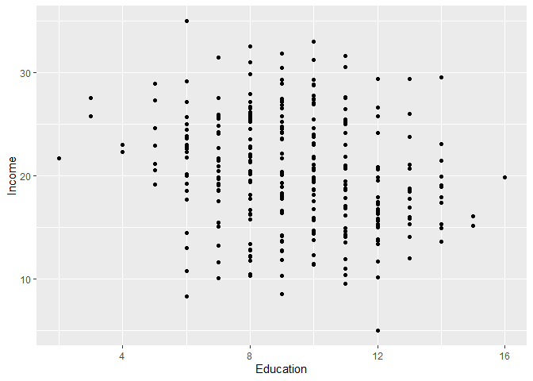
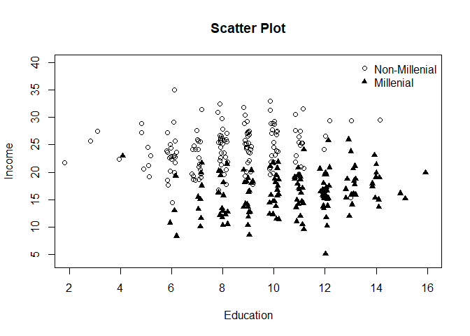

HW2 Q1
================
Vy Dang
2024-09-19

### Problem 1 (Through lecture 6)

We have data from a simple random sample of 300 work-force participants
born before 1997 in a rural area. Using this data, we will try to
understand the relationship between education and income within this
area. Among the variables at our disposal are the years of education for
an individual, stored as Education, and what their income is (in
thousands of dollars), stored as Income. The data is stored in the data
set edu.csv. In the questions that follow, you may assume that the
requisite assumptions needed constructing confidence intervals and
performing hypothesis tests using R’s multiple regression output hold.

1.  (2 pts) Provide a scatterplot with Income on the y-axis and
    Education on the x. Discuss whether the relationship seems linear,
    and whether the association appears to be positive or negative.

``` r
edu <- read.csv("edu.csv")
```

``` r
ggplot(edu, aes(y = Income, x = Education)) + geom_point()
```



Given that the scatterplot shows vertical lines for each education level
without forming any discernible linear pattern, the relationship between
Education and Income might not be linear. There seems to be positive
association here in the graph.

2.  (2 pts) Run a simple regression of Income on Education, and show the
    resulting prediction equation. We will refer to this analysis as
    Analysis I moving forwards.

``` r
Analysis_I <- lm(Income ~ Education, data = edu)
summary(Analysis_I)
```

    ## 
    ## Call:
    ## lm(formula = Income ~ Education, data = edu)
    ## 
    ## Residuals:
    ##     Min      1Q  Median      3Q     Max 
    ## -14.003  -3.296  -0.163   3.979  12.992 
    ## 
    ## Coefficients:
    ##             Estimate Std. Error t value Pr(>|t|)    
    ## (Intercept)  25.2100     1.2392  20.344  < 2e-16 ***
    ## Education    -0.5172     0.1277  -4.051  6.5e-05 ***
    ## ---
    ## Signif. codes:  0 '***' 0.001 '**' 0.01 '*' 0.05 '.' 0.1 ' ' 1
    ## 
    ## Residual standard error: 5.38 on 298 degrees of freedom
    ## Multiple R-squared:  0.0522, Adjusted R-squared:  0.04902 
    ## F-statistic: 16.41 on 1 and 298 DF,  p-value: 6.5e-05

The prediction equation: Income = 25.2100 - 0.5172 \* Education

3.  (4 pts) Is there evidence that the slope coefficient on Education is
    less than -0.1? Conduct your test at α = 0.05.

Ho: $\beta_1 \geq -0.1$ Ha: $\beta_1 < -0.1$

``` r
coefficients <- coef(summary(Analysis_I))
beta1_hat <- coefficients["Education", "Estimate"]
se_beta1_hat <- coefficients["Education", "Std. Error"]
tstat <- (beta1_hat - (-0.1)) / se_beta1_hat
pvalue <- pt(tstat, df = Analysis_I$df.residual, lower.tail = TRUE)
alpha <- 0.05
pvalue
```

    ## [1] 0.0006046154

``` r
if (pvalue <= alpha) {
  cat("Reject the null hypothesis")
} else {
  cat("Fail to reject null hypothesis")
}
```

    ## Reject the null hypothesis

There is sufficient evidence to reject the null hypothesis and conclude
that the slope coefficient on Education is less than -0.1 at the 0.05
significance level.

In addition to our data on Education and Income, we also have, for each
individual, an indicator of whether or not they are considered a member
of the “Millenial” generation (defined as being born between 1980 and
1996).

4.  (2 pts) Show code that runs a multiple regression with Income as the
    response variable, and Education, Millenial, and the interaction
    between Education and Millenial as the predictor variables. We will
    refer to this as Analysis II henceforth.

``` r
edu$Millenial <- as.factor(edu$Millenial)
Analysis_II <- lm(Income ~ Education * Millenial, data = edu)
summary(Analysis_II)
```

    ## 
    ## Call:
    ## lm(formula = Income ~ Education * Millenial, data = edu)
    ## 
    ## Residuals:
    ##      Min       1Q   Median       3Q      Max 
    ## -11.7340  -2.4806  -0.0789   2.3921  11.4760 
    ## 
    ## Coefficients:
    ##                         Estimate Std. Error t value Pr(>|t|)    
    ## (Intercept)             21.12971    1.23767  17.072  < 2e-16 ***
    ## Education                0.39905    0.14565   2.740  0.00652 ** 
    ## MillenialTRUE           -8.15296    1.89865  -4.294 2.38e-05 ***
    ## Education:MillenialTRUE -0.08595    0.19761  -0.435  0.66393    
    ## ---
    ## Signif. codes:  0 '***' 0.001 '**' 0.01 '*' 0.05 '.' 0.1 ' ' 1
    ## 
    ## Residual standard error: 3.655 on 296 degrees of freedom
    ## Multiple R-squared:  0.5654, Adjusted R-squared:  0.561 
    ## F-statistic: 128.3 on 3 and 296 DF,  p-value: < 2.2e-16

5.  (4 pts) Using the output from the regression, provide two separate
    prediction equations: one for Millenial individuals, and one for
    Non-Millenial individuals.

The general equation including interaction terms is:
$$\text{Income} = \beta_0 + \beta_1 \times \text{Education} + \beta_2 \times \text{Millenial} + \beta_3 \times (\text{Education} \times \text{Millenial})$$
For non-millenials individuals (Millenial = 0 which means Education x
Millenial = 0):
$$ \text{Income}_{\text{non-Millenial}} = \beta_0 + \beta_1 \times \text{Education} $$
Substitute in the coefficients:
$$\text{Income}_{\text{non-Millenial}} = 21.12971 + 0.39905 \times \text{Education}$$

For millenial individuals (when Millenial = 1, Education x Millenial =
Education):
$$ \text{Income}_{\text{Millenial}} = \beta_0 + \beta_1 \times \text{Education} + \beta_2 + \beta_3 \times \text{Education} $$
Simplifying:
$$\text{Income}_{\text{Millenial}} = (\beta_0 + \beta_2) + (\beta_1 + \beta_3) \times \text{Education}$$
Substitute in the coefficients:
$$\text{Income}{\text{Millenial}} = (21.12971 - 8.15296) + (0.39905 - 0.08595) \times \text{Education}$$
$$\text{Income}{\text{Millenial}} = 12.97675 + 0.3131 \times \text{Education}$$

6.  (4 pts) Consider the following two groups of individuals: group one
    is the collection of non-Millenials in the rural area with 8 years
    of education, and group two is the collection of non-Millenial
    individuals in the rural area with 7 years of education. Based on
    your analysis, is there evidence that the difference in expected
    income between group one and group two is greater than \$100
    dollars? Conduct your test at α = 0.05.

Ho: Difference in exp. income \<= 100 Ha: Difference in exp. income \>
100

Using this equation:
$$\text{Income}{\text{Millenial}} = 12.97675 + 0.3131 \times \text{Education}$$
Difference in expected income between non-Millenials in the rural area
with 8 years of education and non-Millenial individuals in the rural
area with 7 years of education:
$$[21.12971 + 0.39905 \times 8] - [21.12971 + 0.39905 \times 7] = 0.39905 (thousandsof dollars) = 399.05 (dollars)$$

``` r
tstat_f <- (399.05 - 100) / 0.14565
pvalue_f <- pt(tstat_f, df = Analysis_II$df.residual, lower.tail = FALSE)
alpha <- 0.05
pvalue_f
```

    ## [1] 0

``` r
if(pvalue_f <= alpha) {
  cat("Reject the null hypothesis")
} else {
  cat("Fail to reject the null hypothesis")
}
```

    ## Reject the null hypothesis

Here we reject the null hypothesis and there’s significant evidence that
the difference in income is greater than \$100.

7.  (3 pts) Construct a 90% confidence interval for the difference
    between slope coefficients on Education in the population regression
    lines describing Millenials versus non-Millenials.

``` r
coefficients_II <- coef(summary(Analysis_II))
interaction_coef <- coefficients_II["Education:MillenialTRUE", "Estimate"]
interaction_se <- coefficients_II["Education:MillenialTRUE", "Std. Error"]
df <- summary(Analysis_II)$df[2]
alpha_g <- 0.1
t_critical <- qt(1 - alpha_g / 2, df)
ci_lower <- interaction_coef - t_critical * interaction_se
ci_upper <- interaction_coef + t_critical * interaction_se
ci_lower
```

    ## [1] -0.4120111

``` r
ci_upper
```

    ## [1] 0.2401167

The 90% confidence interval for the difference between the slope
coefficients on Education for Millenials versus non-Millenials is
approximately: \[(-0.41082, 0.23892)\]

8.  (2 pts) Is there evidence that the model yielding Analysis II
    provides an improvement in predictive performance over a model that
    doesn’t use any predictor variables? Conduct your test at α = 0.05.

``` r
null_model <- lm(Income ~ 1, data = edu)
anova <- anova(null_model, Analysis_II)
anova
```

    ## Analysis of Variance Table
    ## 
    ## Model 1: Income ~ 1
    ## Model 2: Income ~ Education * Millenial
    ##   Res.Df    RSS Df Sum of Sq      F    Pr(>F)    
    ## 1    299 9100.4                                  
    ## 2    296 3955.3  3    5145.2 128.35 < 2.2e-16 ***
    ## ---
    ## Signif. codes:  0 '***' 0.001 '**' 0.01 '*' 0.05 '.' 0.1 ' ' 1

``` r
pvalue_h <- anova$'Pr(>F)'[2]
alpha_h <- 0.05
pvalue_h
```

    ## [1] 2.863116e-53

``` r
if(pvalue_h <= alpha) {
  cat("Reject the null hypothesis")
} else {
  cat("Fail to reject the null hypothesis")
}
```

    ## Reject the null hypothesis

Since we reject the null hypothesis, the model with predictor variables
provides a significantly better fit than the intercept-only model at the
0.05 significance level.

1.  (3 pts) A crotchety old man confronts you about these two analyses,
    and says that one of them must be incorrect. He says, “Analysis II
    tells me that if I went back to school for two more years I would
    earn more money, but Analysis I tells me that if I went back to
    school for two more years I would lose money. What a crock of
    \[manure\] - you must have \[made a mistake somewhere\]!” (his exact
    expression was censored for the purpose of this homework). What’s
    wrong with the crotchety old man’s interpretation of your analyses?

For Analysis I: The model indicates a negative relationship between
education and income. This suggests that, on average, income decreases
as education increases by 0.5172 for each additional year of education.
Analysis I considers the entire sample without differentiating between
subgroups.

For Analysis II: This model takes into account the interaction between
Education and Millenial status. Analysis II distinguishes between
Millenials and non-Millenials. It shows that within these subgroups,
education indeed increases income, but the degree varies between
Millenials and non-Millenials.

- For non-Millenials: Income increases by \$399.05 per additional year
  of education.

- For Millenials: Income increases by \$313.1 per additional year of
  education (0.39905 - 0.08595).

So the old man is likely misinterpreting the results because he is
applying the simple model’s (Analysis I) finding across all contexts,
without considering the richer, subgroup-specific findings (Analysis
II). The interaction term in Analysis II indicates that the relationship
between education and income differs for Millenials compared to
non-Millenials, which is a critical insight missing in Analysis I.

10. (5 pts) To further convince the man of the error in his ways, you
    recall the advice from your Statistics professor that you must
    always plot your data. There is code provided in the R script
    accompanying this that creates a scatter plot of the data, but
    denotes Millenials and non-Millenials using different plotting
    symbols. The plot is also “jittered” to avoid overplotting (this
    means a small amount of noise is added to the x and y values being
    plotted). Study the plot. After reflection, explain in words the
    source of the differences between what you observed in Analysis I
    and Analysis II.

``` r
Education <- edu$Education
Income <- edu$Income
Millenial= edu$Millenial
plot(Education, Income, type = "n", main="Scatter Plot", ylim = c(4, 40))
points(jitter(Education[Millenial==F],1), Income[Millenial == F], pch = 1, cex = 1)
points(jitter(Education[Millenial == T],1), Income[Millenial == T], pch = 17, cex = 1)
legend("topright", c("Non-Millenial", "Millenial"), pch = c(1, 17), cex = 1, bty = "n")
```



Observation:

Clusters of Points:

- Non-Millenials: These data points are scattered around different
  education levels with a certain trend in income

- Millenials: These data points look similarly scattered but might show
  a different trend compared to the non-Millenials

Trends:

- For Non-Millenials: Generally, as education increases, there’s no
  significant upward or downward movement in income

- For Millenials: There might be a weaker upward trend in income with
  increasing education

Source of differences:

Analysis I fails to account for subgroup differences, aggregating all
data points into a single trend. This overlooks key interaction effects.
However, analysis II reveals more accurate subgroup-specific effects by
considering the interaction term. By looking at the plot, we can see
that non-Millenials and Millenials have different distributions and
trends in their data. The scatter plot shows distinct clusters and
trends for Millenials and non-Millenials, so we need the interaction
term in Analysis II to capture these distinct patterns accurately.
