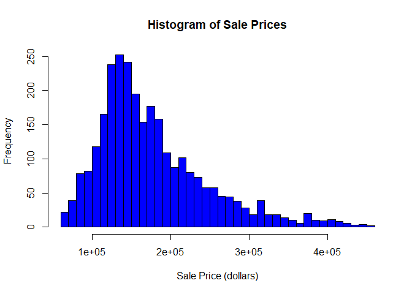
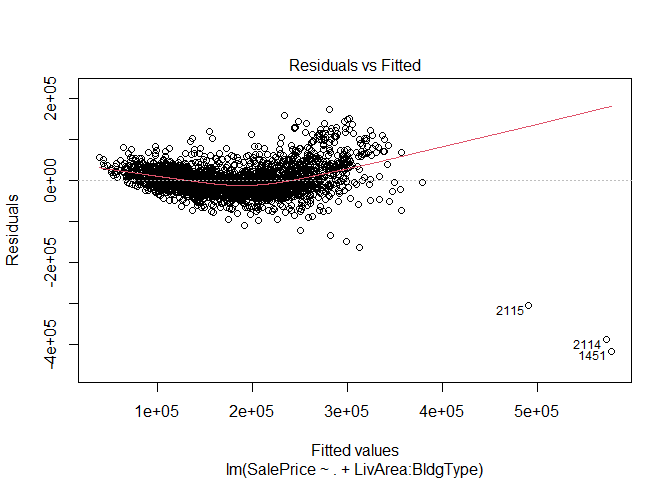
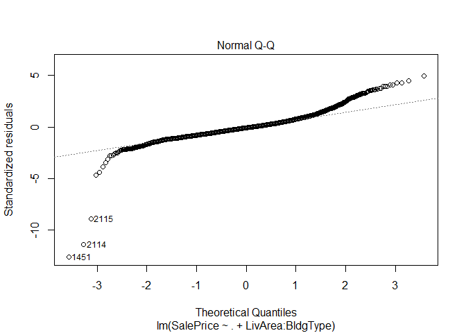
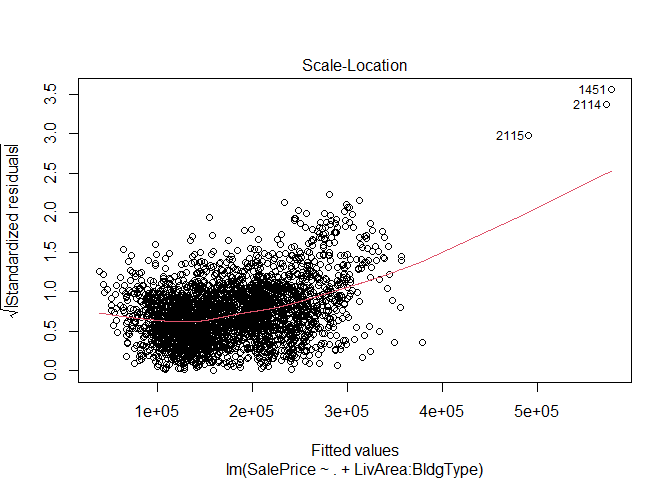
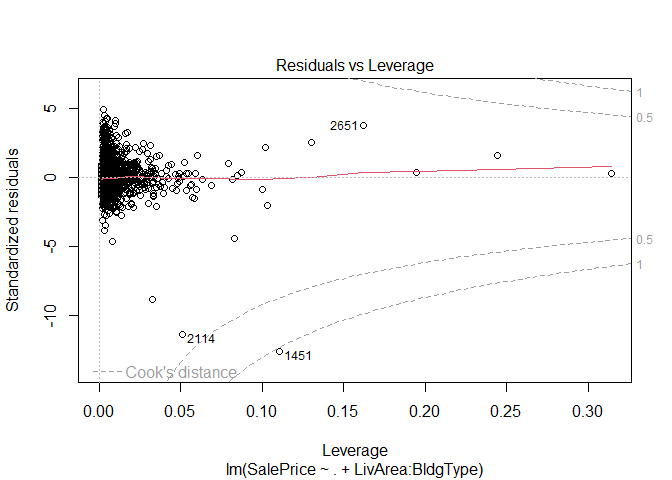
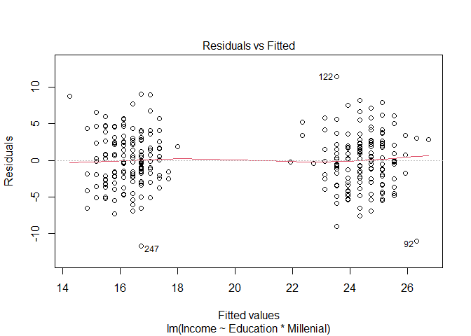
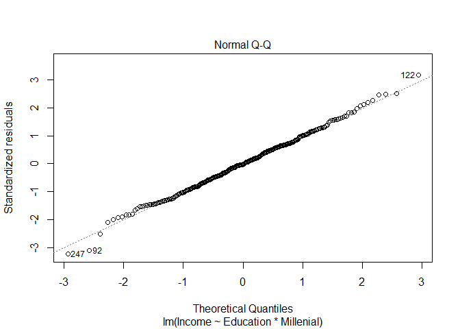
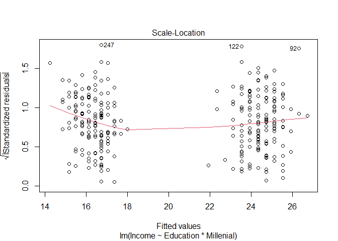
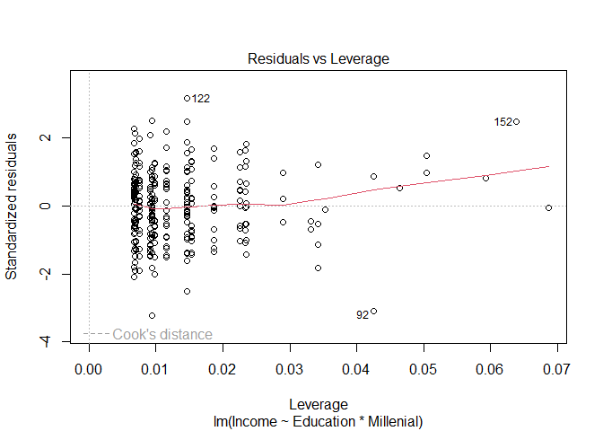

Vy Dang
2024-09-30

## Problem 1 (through Lecture 9)

In this problem, we consider the Ames, Iowa Housing Prices dataset,
which describes sales of 2,838 properties in the town of Ames, Iowa from
2006 to 20101. You will work with the dataset provided in the
AmesSales.csv file. This file has been pre-processed to simplify the
analysis. We started with a partially processed set available on Github2
and selected a few of the most relevant variables to include in our
analysis. The file contains 12 variables, described below. The first
variable is the property’s sale price—which we aim to predict. The other
variables describe the property details in quantitative terms (square
footage, number of rooms, date of construction). There is one
categorical variable, BldgType, which describes different types of homes
(e.g. townhouse, duplex, etc.). • SalePrice - the property’s sale price
(dollars) • TotalRooms: Total number of rooms • Bedrooms: \# bedrooms •
FullBath: Full bathrooms • HalfBath: Half baths • LivArea: Ground living
area (sq. feet) • Fireplaces: Number of fireplaces • GarageArea: Size of
garage (sq. feet) • PoolArea: Size of pool (sq. feet) • YearBuilt:
Original construction date • YearSold: Year Sold • BldgType: Type of
dwelling Run the following commands to read in the data and make sure
SalePrice is encoded as a numeric variable and not a factor variable.

``` r
ames = read.csv ("AmesSales.csv")
ames$SalePrice = as.numeric(ames$SalePrice)
```

1.  (2 pts) Use the hist() function on SalePrice to view the
    distribution of the dependent variable. Describe its shape.

``` r
hist(ames$SalePrice, 
     main = "Histogram of Sale Prices",
     xlab = "Sale Price (dollars)",
     ylab = "Frequency",
     col = "blue",
     breaks = 30) 
```



In problems (b)-(d), you may assume that the stronger linear model
holds. b. (1 pt) Fit a linear regression that predicts SalePrice as a
linear function of all of the other variables in the data set (i.e., all
of the other columns of the data set)

``` r
model <- lm(SalePrice ~ ., data = ames)
summary(model)
```

    ## 
    ## Call:
    ## lm(formula = SalePrice ~ ., data = ames)
    ## 
    ## Residuals:
    ##     Min      1Q  Median      3Q     Max 
    ## -420874  -20319   -2800   15500  172652 
    ## 
    ## Coefficients:
    ##                  Estimate Std. Error t value Pr(>|t|)    
    ## (Intercept)    -1.016e+06  1.020e+06  -0.996   0.3192    
    ## TotalRooms      1.806e+03  8.611e+02   2.097   0.0361 *  
    ## Bedrooms       -1.245e+04  1.192e+03 -10.440  < 2e-16 ***
    ## FullBath        2.916e+02  1.859e+03   0.157   0.8754    
    ## HalfBath       -1.258e+04  1.605e+03  -7.841 6.29e-15 ***
    ## Fireplaces      1.328e+04  1.195e+03  11.111  < 2e-16 ***
    ## LivArea         7.892e+01  3.017e+00  26.158  < 2e-16 ***
    ## GarageArea      5.993e+01  4.090e+00  14.654  < 2e-16 ***
    ## PoolArea       -1.038e+02  1.952e+01  -5.315 1.15e-07 ***
    ## YearBuilt       8.709e+02  3.062e+01  28.444  < 2e-16 ***
    ## YearSold       -3.210e+02  5.064e+02  -0.634   0.5263    
    ## BldgType2fmCon -1.142e+04  4.737e+03  -2.411   0.0160 *  
    ## BldgTypeDuplex -3.581e+04  3.702e+03  -9.674  < 2e-16 ***
    ## BldgTypeTwnhs  -2.889e+04  3.780e+03  -7.643 2.90e-14 ***
    ## BldgTypeTwnhsE -1.151e+04  2.731e+03  -4.216 2.56e-05 ***
    ## ---
    ## Signif. codes:  0 '***' 0.001 '**' 0.01 '*' 0.05 '.' 0.1 ' ' 1
    ## 
    ## Residual standard error: 35400 on 2823 degrees of freedom
    ## Multiple R-squared:  0.7468, Adjusted R-squared:  0.7455 
    ## F-statistic: 594.6 on 14 and 2823 DF,  p-value: < 2.2e-16

3.  (2 pts) Fit a new linear model that predicts SalePrice as a linear
    function of the other variables in the data set, and that
    additionally allows the slope coefficient on LivArea to vary as a
    function of BldgType.

``` r
model_interaction <- lm(SalePrice ~ . + LivArea:BldgType, data = ames)
summary(model_interaction)
```

    ## 
    ## Call:
    ## lm(formula = SalePrice ~ . + LivArea:BldgType, data = ames)
    ## 
    ## Residuals:
    ##     Min      1Q  Median      3Q     Max 
    ## -417600  -19738   -2639   15254  173605 
    ## 
    ## Coefficients:
    ##                          Estimate Std. Error t value Pr(>|t|)    
    ## (Intercept)            -1.439e+06  1.013e+06  -1.421  0.15553    
    ## TotalRooms              2.007e+03  8.558e+02   2.345  0.01911 *  
    ## Bedrooms               -1.152e+04  1.202e+03  -9.584  < 2e-16 ***
    ## FullBath                4.304e+02  1.844e+03   0.233  0.81540    
    ## HalfBath               -1.191e+04  1.597e+03  -7.460 1.15e-13 ***
    ## Fireplaces              1.292e+04  1.185e+03  10.901  < 2e-16 ***
    ## LivArea                 7.763e+01  3.009e+00  25.799  < 2e-16 ***
    ## GarageArea              6.080e+01  4.058e+00  14.981  < 2e-16 ***
    ## PoolArea               -1.021e+02  1.935e+01  -5.278 1.41e-07 ***
    ## YearBuilt               8.612e+02  3.055e+01  28.188  < 2e-16 ***
    ## YearSold               -1.023e+02  5.030e+02  -0.203  0.83889    
    ## BldgType2fmCon          2.118e+04  1.432e+04   1.479  0.13927    
    ## BldgTypeDuplex         -3.910e+03  1.273e+04  -0.307  0.75868    
    ## BldgTypeTwnhs           1.689e+03  1.432e+04   0.118  0.90607    
    ## BldgTypeTwnhsE         -7.790e+04  1.124e+04  -6.931 5.16e-12 ***
    ## LivArea:BldgType2fmCon -2.177e+01  9.014e+00  -2.415  0.01580 *  
    ## LivArea:BldgTypeDuplex -1.988e+01  7.497e+00  -2.652  0.00804 ** 
    ## LivArea:BldgTypeTwnhs  -2.420e+01  1.103e+01  -2.194  0.02829 *  
    ## LivArea:BldgTypeTwnhsE  5.039e+01  8.102e+00   6.219 5.74e-10 ***
    ## ---
    ## Signif. codes:  0 '***' 0.001 '**' 0.01 '*' 0.05 '.' 0.1 ' ' 1
    ## 
    ## Residual standard error: 35070 on 2819 degrees of freedom
    ## Multiple R-squared:  0.7518, Adjusted R-squared:  0.7502 
    ## F-statistic: 474.4 on 18 and 2819 DF,  p-value: < 2.2e-16

4.  (4 pts) Compare the R2 between the regression models you fit in (b)
    and (c). Based on this comparison alone, can you determine whether
    the model you fit in (c) provides a statistically significant
    improve- ment in predictive power relative to the model you fit in
    (b)? If so, explain why. If not, present an analysis which entitles
    you to a determination of whether the model you fit in (c) provides
    a substantial improvement in predictive power relative to the model
    you fit in (b).

Multiple R^2 increases from 0.7468 to 0.7518. Adjusted R^2 increases
from 0.7455 to 0.7502. The increase in these values suggests an
improvement in explanatory power when adding the interaction term.
However, these values alone don’t confirm if the improvement is
statistically significant. Here we conduct an f-test:

``` r
anova(model, model_interaction)
```

    ## Analysis of Variance Table
    ## 
    ## Model 1: SalePrice ~ TotalRooms + Bedrooms + FullBath + HalfBath + Fireplaces + 
    ##     LivArea + GarageArea + PoolArea + YearBuilt + YearSold + 
    ##     BldgType
    ## Model 2: SalePrice ~ TotalRooms + Bedrooms + FullBath + HalfBath + Fireplaces + 
    ##     LivArea + GarageArea + PoolArea + YearBuilt + YearSold + 
    ##     BldgType + LivArea:BldgType
    ##   Res.Df        RSS Df  Sum of Sq     F    Pr(>F)    
    ## 1   2823 3.5381e+12                                  
    ## 2   2819 3.4673e+12  4 7.0799e+10 14.39 1.236e-11 ***
    ## ---
    ## Signif. codes:  0 '***' 0.001 '**' 0.01 '*' 0.05 '.' 0.1 ' ' 1

- The RSS decreases from Model 1 to Model 2, indicating a better fit in
  Model 2.
- Since p-value for the f-statistics is 1.236e-11 (extremely low) \<
  0.05. This indicates that the improvement in the model fit due to the
  inclusion of the interaction terms is highly statistically
  significant. So Model 2 provides a substantial and statistically
  significant improvement in predictive power compared to Model 1.

5.  (4 pts) Using the regression you fit in (c), create appropriate
    diagnostic plots to assess whether or not the assumptions of the
    stronger linear model appear reasonable for this data set. For any
    residual plots you create, it is sufficient for this problem to only
    create plots with “fitted values” on the x axis (no need to
    investigate each predictor variable).

``` r
plot(model_interaction)
```



6.  (3 pts) A friend wants to use your analysis in (c) to construct a
    95% prediction interval for a home he is interested in purchasing in
    Ames in order to see whether the list price is egregiously high. He
    provides you the values for the 11 predictor variables involved in
    your model, and asks you to use R to construct a prediction interval
    using the formulas we derived in class. In light of your findings in
    (e), would you have any concerns about fulfilling your friend’s
    request?

Based on the findings from the diagnostic plots in (e):

- Linearity: No pattern seen in the Residuals vs Fitted plot, we can
  assume linearity

- Normality: Points fall roughly along a straight line on the normal Q-Q
  plot, suggesting that residuals are normally distributed

- Homoscedasticity: The Scale-Location plot shows no discernible pattern
  of the points (randomly scattered), which we can infer
  homoscedasticity and we know the prediction intervals might not be too
  wide or too narrow.

- Influential Points: There’s only 1 point outside the dashed line
  Cook’s distance. This suggests the model might still be robust but
  caution is advised. Even though this point is influential, its
  singularity might imply limited overall impact on the model’s
  predictions.

## Problem 2 (through Lecture 9)

In this problem we will revisit the Education data set from Homework 2,
stored in the data set edu.csv. As a reminder, the data set consists of
300 work-force participants born before 1997 in a rural area. The
variables at our disposal are the years of education for an individual,
stored as Education, and what their income is (in thousands of dollars),
stored as Income. In addition we also have, for each individual, an
indicator of whether or not they are considered a member of the
“Millenial” generation (defined as being born between 1980 and 1996).

1.  (4 pts) Run a regression with Income as the response variable, and
    Education, Millenial, and the interaction between Education and
    Millenial as the predictor variables. Then, create appropriate
    diagnostic plots to assess whether or not the assumptions of the
    stronger linear model appear reasonable for this data set. For any
    residual plots you create, it is sufficient for this problem to only
    create plots with “fitted values” on the x axis (no need to
    investigate each predictor variable).

``` r
edu <- read.csv("edu.csv")
edu$Millenial <- factor(edu$Millenial)
edu_model <- lm(Income ~ Education*Millenial, data = edu)
summary(edu_model)
```

    ## 
    ## Call:
    ## lm(formula = Income ~ Education * Millenial, data = edu)
    ## 
    ## Residuals:
    ##      Min       1Q   Median       3Q      Max 
    ## -11.7340  -2.4806  -0.0789   2.3921  11.4760 
    ## 
    ## Coefficients:
    ##                         Estimate Std. Error t value Pr(>|t|)    
    ## (Intercept)             21.12971    1.23767  17.072  < 2e-16 ***
    ## Education                0.39905    0.14565   2.740  0.00652 ** 
    ## MillenialTRUE           -8.15296    1.89865  -4.294 2.38e-05 ***
    ## Education:MillenialTRUE -0.08595    0.19761  -0.435  0.66393    
    ## ---
    ## Signif. codes:  0 '***' 0.001 '**' 0.01 '*' 0.05 '.' 0.1 ' ' 1
    ## 
    ## Residual standard error: 3.655 on 296 degrees of freedom
    ## Multiple R-squared:  0.5654, Adjusted R-squared:  0.561 
    ## F-statistic: 128.3 on 3 and 296 DF,  p-value: < 2.2e-16

``` r
plot(edu_model)
```



2.  (3 pts) Discuss your findings in (a). Do the assumptions of the
    stronger linear model seem reasonable?

- Linearity: The Residuals vs Fitted plot points to potential
  non-linearity or differing relationships within subsets of data,
  particularly between Millenials and non-Millenials.

- Normality: Points fall roughly along a straight line on the normal Q-Q
  plot, suggesting that residuals are normally distributed

- Homoscedasticity: The Scale-Location plot indicates issues with
  constant variance (heteroscedasticity), showing two clusters of data
  points

- Influential Points: The Residuals vs Leverage plot does not indicate
  significant issues with influential points.

Based on this, the assumptions of the stronger linear model may not hold
true in this case.

3.  (3 pts) Construct an appropriate 95% interval for expected income
    for the population of Millenial residents in the rural area with 8
    years of education. Regardless of your answer in (b), you may assume
    that the stronger linear model holds when forming this interval.

``` r
new_data <- data.frame(
  Education = 8,
  Millenial = TRUE
)
new_data$Millenial <- factor(new_data$Millenial, levels = levels(edu$Millenial))
conf_int <- predict(edu_model, newdata = new_data, interval = "confidence", level = 0.95)
conf_int
```

    ##        fit      lwr     upr
    ## 1 15.48157 14.59104 16.3721

We’ll now apply our new results to the regression analysis we conducted
in Problem 2. For the questions that follow, you should provide
numerical answers along with code that generates the requested
intervals. g. (5 pts) Construct an appropriate 95% interval for the
difference in incomes between the following two individuals from the
rural area: one person is a millenial with 8 years of education, and the
other person is a non-millenial with 7 years of education. You may form
any required standard errors by replacing σε with ˆσε, and you may base
your intervals off of a t distribution.

``` r
c <- data.frame(Education = 8, Millenial = 'TRUE')
d <- data.frame(Education = 7, Millenial = 'FALSE')
pred_c <- predict(edu_model, newdata = c)
pred_d <- predict(edu_model, newdata = d)
pred_c
```

    ##        1 
    ## 15.48157

``` r
pred_d
```

    ##        1 
    ## 23.92305

``` r
diff_pred <- pred_c - pred_d
V_beta <- vcov(edu_model)
diff_vec <- c(1, 8, 1, 8) - c(1, 7, 0, 0)
se_diff <- sqrt(t(diff_vec) %*% V_beta %*% diff_vec)
df <- nrow(edu) - length(coef(edu_model))
t_critical <- qt(0.975, df)
margin_of_error <- t_critical * se_diff
lower_bound <- diff_pred - margin_of_error
upper_bound <- diff_pred + margin_of_error
conf_interval <- c(lower_bound, upper_bound)
conf_interval
```

    ## [1] -9.566549 -7.316420

8.  (4 pts) Construct an appropriate 95% interval for the difference in
    incomes between two people who share the same values for Millenial
    and Education. You may form any required standard errors by
    replacing σε with ˆσε, and you may base your intervals off of a t
    distribution. If you don’t have enough information to form your
    interval, explain what additional information you would need.

``` r
model_summary <- summary(edu_model)
sigma_hat <- model_summary$sigma
df <- nrow(edu) - length(coef(edu_model))
t_critical <- qt(0.975, df)
se_diff = sqrt(2) * sigma_hat
margin_of_error <- t_critical * se_diff
lower_bound <- 0 - margin_of_error
upper_bound <- 0 + margin_of_error
conf_interval <- c(lower_bound, upper_bound)
conf_interval
```

    ## [1] -10.17384  10.17384
