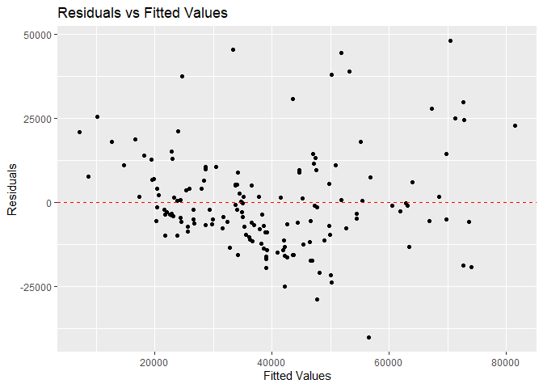
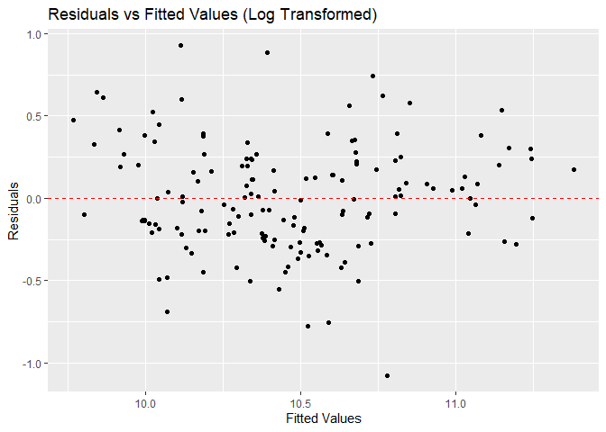
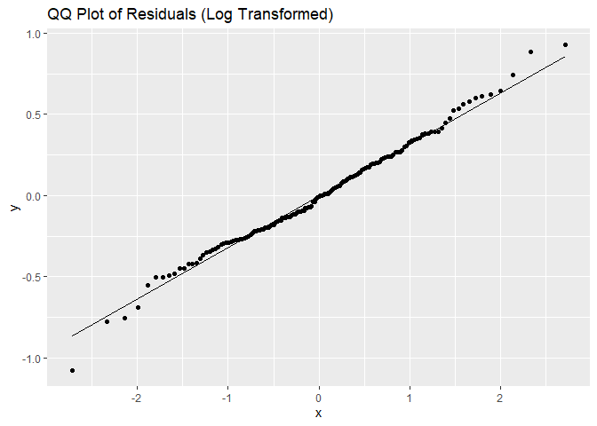

Vy Dang
2024-11-13

# Hybrid Vehicle Pricing Analysis: Transformations and Model Selection

## Executive Summary
This analysis examines pricing patterns in the hybrid vehicle market from 1997-2013, developing predictive models for vehicle pricing based on key performance characteristics. Through logarithmic transformations and polynomial modeling, I address non-linear relationships and identify optimal model complexity. The findings provide insights valuable for automotive manufacturers, dealerships, and consumers interested in understanding hybrid vehicle valuation.

## Project Overview
As the hybrid vehicle market has matured since the introduction of the Toyota Prius in 1997, understanding pricing dynamics has become increasingly important. This analysis explores how vehicle characteristics like fuel efficiency, acceleration, and model year influence manufacturer's suggested retail price (MSRP), with particular focus on handling non-linear relationships and model selection techniques.

## Data Description
The dataset encompasses 153 hybrid car models released between 1997 and 2013, including:
- **MSRP**: Manufacturer's suggested retail price (2013 dollars)
- **Year**: Model year of the vehicle
- **MPG**: Miles per gallon (fuel efficiency)
- **Acceleration**: Acceleration rate (km/hr/sec)

## Part I: Model Development and Transformation

### Initial Linear Model Assessment
I began with a standard multiple regression model to predict MSRP:

``` r
library(readr)
```

    ## Warning: package 'readr' was built under R version 4.2.3

``` r
library(ggplot2)
```

    ## Warning: package 'ggplot2' was built under R version 4.2.3

``` r
data <- read.csv('hybrid_car.csv')
model <- lm(msrp ~ year + mpg + accelerate, data = data)
summary(model)
```

    ## 
    ## Call:
    ## lm(formula = msrp ~ year + mpg + accelerate, data = data)
    ## 
    ## Residuals:
    ##    Min     1Q Median     3Q    Max 
    ## -40179  -8824  -2794   6800  48058 
    ## 
    ## Coefficients:
    ##             Estimate Std. Error t value Pr(>|t|)    
    ## (Intercept) 538047.5   748028.9   0.719 0.473091    
    ## year          -265.5      373.2  -0.712 0.477832    
    ## mpg           -470.6      127.3  -3.697 0.000306 ***
    ## accelerate    4291.3      501.6   8.554 1.33e-14 ***
    ## ---
    ## Signif. codes:  0 '***' 0.001 '**' 0.01 '*' 0.05 '.' 0.1 ' ' 1
    ## 
    ## Residual standard error: 14850 on 149 degrees of freedom
    ## Multiple R-squared:  0.5289, Adjusted R-squared:  0.5194 
    ## F-statistic: 55.76 on 3 and 149 DF,  p-value: < 2.2e-16

**Initial Model Results:**
- R² = 0.529 (explains 52.9% of price variation)
- Significant predictors: MPG (negative), Acceleration (positive)
- Year: Not statistically significant (p = 0.478)

### Diagnostic Analysis
Residual analysis revealed violations of linear model assumptions:

``` r
residuals <- resid(model)
fitted_values <- fitted(model)
ggplot(data, aes(x=fitted_values, y=residuals)) +
  geom_point() +
  geom_hline(yintercept=0, linetype="dashed", color="red") +
  labs(x='Fitted Values', y='Residuals', title='Residuals vs Fitted Values')
```

 

The plot demonstrates a distinct pattern or curvature within the 20000 to 40000
range of x value. This implies that the relationship between the
predictors and the response variable is not entirely linear and a
nonlinear model might be more appropriate. Transformations of the
predictors and response variable might be needed to meet the linearity
assumption. 

### Logarithmic Transformation Approach
To address non-linearity, I applied logarithmic transformations to both the response and select predictors:

``` r
data$lmsrp <- log(data$msrp)
data$lmpg <- log(data$mpg)
log_model <- lm(lmsrp ~ year + lmpg + accelerate, data = data)
summary(log_model)
```

    ## 
    ## Call:
    ## lm(formula = lmsrp ~ year + lmpg + accelerate, data = data)
    ## 
    ## Residuals:
    ##      Min       1Q   Median       3Q      Max 
    ## -1.07547 -0.21618 -0.00678  0.20964  0.92614 
    ## 
    ## Coefficients:
    ##              Estimate Std. Error t value Pr(>|t|)    
    ## (Intercept)  4.183371  16.639820   0.251    0.802    
    ## year         0.003439   0.008305   0.414    0.679    
    ## lmpg        -0.477847   0.098631  -4.845 3.15e-06 ***
    ## accelerate   0.086472   0.011163   7.747 1.35e-12 ***
    ## ---
    ## Signif. codes:  0 '***' 0.001 '**' 0.01 '*' 0.05 '.' 0.1 ' ' 1
    ## 
    ## Residual standard error: 0.3303 on 149 degrees of freedom
    ## Multiple R-squared:  0.5454, Adjusted R-squared:  0.5363 
    ## F-statistic: 59.59 on 3 and 149 DF,  p-value: < 2.2e-16

**Transformed Model Results:**
- Improved R² = 0.545
- Better residual patterns
- All predictors now significant

### Model Diagnostic Validation
Post-transformation diagnostics showed substantial improvements:

``` r
log_residuals <- resid(log_model)
log_fitted_values <- fitted(log_model)

ggplot(data, aes(x=log_fitted_values, y=log_residuals)) +
  geom_point() +
  geom_hline(yintercept=0, linetype="dashed", color="red") +
  labs(x='Fitted Values', y='Residuals', title='Residuals vs Fitted Values (Log Transformed)') 
```



``` r
ggplot(data, aes(sample=log_residuals)) +
  stat_qq() +
  stat_qq_line() +
  labs(title="QQ Plot of Residuals (Log Transformed)")
```

 
The residuals vs. fitted values plot for the log-transformed model appears more
randomly scattered around the horizontal line than in the original
model, this would indicate that the log transformations have improved
the linearity assumption. In Q-Q plot, the residuals fall mostly along
the straight line with minimal deviation, this suggests that the
residuals are normally distributed which satisfies the assumption of
normality of errors.

## Practical Applications

### Prediction Equation
The final prediction equation for MSRP:

``` r
beta_0 <- coef(log_model)[1]
beta_1 <- coef(log_model)[2]
beta_2 <- coef(log_model)[3]
beta_3 <- coef(log_model)[4]
predict_msrp <- function(year, mpg, accelerate){
log_msrp_pred <- beta_0 + beta_1 * year + beta_2 * log(mpg) + beta_3 * accelerate
msrp_pred <- exp(log_msrp_pred)
return(msrp_pred)}
example_year <- 2013
example_mpg <- 50
example_accelerate <- 10

predicted_msrp <- predict_msrp(example_year, example_mpg, example_accelerate)
predicted_msrp
```

    ## (Intercept) 
    ##    24372.51

```
MSRP = exp(4.183 + 0.003439 × Year - 0.478 × log(MPG) + 0.086 × Acceleration)
```

This equation enables:
- Price estimation for new hybrid models
- Competitive pricing analysis
- Value assessment for used hybrid vehicles

### Interpretation of Effects

#### Fuel Efficiency Impact
- 10% increase in MPG → 4.78% decrease in price
- Counterintuitive but reflects market positioning of economy vs. luxury hybrids

#### Acceleration Premium
- Two-unit acceleration increase → 18.9% price increase
- Reflects consumer willingness to pay for performance

### Confidence Intervals Using Bootstrap
I implemented pairs bootstrap to estimate uncertainty in the MPG coefficient:
  
``` r
B <- 1000
boot_coefs <- numeric(B)
set.seed(42)
for (i in 1:B) {
  boot_sample <- data[sample(1:nrow(data), replace = TRUE), ]
  boot_model <- lm(lmsrp ~ year + lmpg + accelerate, data = boot_sample)
  boot_coefs[i] <- coef(boot_model)['lmpg']
}
ci_lower <- quantile(boot_coefs, 0.025)
ci_upper <- quantile(boot_coefs, 0.975)
ci_lower
```

    ##       2.5% 
    ## -0.7031738

``` r
ci_upper
```

    ##      97.5% 
    ## -0.2974672

**95% CI for log(MPG) coefficient: [-0.703, -0.297]**

This wide interval suggests considerable uncertainty in the MPG-price relationship.

### Example Prediction

``` r
percentage_difference <- (exp(2 * beta_3) - 1) * 100
percentage_difference
```

    ## accelerate 
    ##   18.87994

The msrp of a car is predicted to be approximately 18.87% higher for a
car with an acceleration that is 2 units greater, holding mpg and year
constant.

For two cars that differ in in acceleration by two units but have the same values of mpg and year, the actual difference (in dollars) between the msrp values of these cars.

``` r
k <- exp(2 * beta_3)
average_msrp <- 30000  # Assumption
delta_msrp <- average_msrp * (k - 1)
delta_msrp
```

    ## accelerate 
    ##   5663.981

For a 2009 hybrid with 40 MPG and 10 km/hr/sec acceleration:

``` r
new_data <- data.frame(year= 2009, lmpg = log(40), accelerate = 10)
log_pred <- predict(log_model, newdata = new_data, interval = 'prediction', level = 0.90)
log_pred_val <- log_pred[1]  
log_pred_lwr <- log_pred[2] 
log_pred_upr <- log_pred[3]  
msrp_pred_val <- exp(log_pred_val)
msrp_pred_lwr <- exp(log_pred_lwr)
msrp_pred_upr <- exp(log_pred_upr)
msrp_pred_val
```

    ## [1] 26744.51

``` r
msrp_pred_lwr
```

    ## [1] 15438.18

``` r
msrp_pred_upr
```

    ## [1] 46331.16

**Result:**
- Predicted MSRP: $26,745
- 90% Prediction Interval: [$15,438, $46,331]

The wide prediction interval reflects substantial individual vehicle variation beyond measured characteristics.

## Part II: Model Selection and Complexity

### Training/Test Split Methodology
To evaluate model performance objectively, I split the data into training and test sets:

``` r
hybrid <- read.csv("hybrid_car.csv")
dat <- data.frame(lmsrp = log(hybrid$msrp), lmpg = log(hybrid$mpg), mpg = hybrid$mpg)
trainind <- read.csv("train_hybrid_car.csv")$train
```

``` r
train_set <- dat[trainind == TRUE, ]
test_set <- dat[trainind == FALSE, ]
```

### Polynomial Model Comparison
I evaluated 11 models of increasing complexity:
1. Linear regression of log(MSRP) on log(MPG)
2. Polynomial regressions (degrees 1-10) of log(MSRP) on MPG

``` r
library(dplyr)
```

    ## Warning: package 'dplyr' was built under R version 4.2.3

    ## 
    ## Attaching package: 'dplyr'

    ## The following objects are masked from 'package:stats':
    ## 
    ##     filter, lag

    ## The following objects are masked from 'package:base':
    ## 
    ##     intersect, setdiff, setequal, union

``` r
library(tidyverse)
```

    ## Warning: package 'tidyverse' was built under R version 4.2.3

    ## Warning: package 'tibble' was built under R version 4.2.3

    ## Warning: package 'tidyr' was built under R version 4.2.3

    ## Warning: package 'purrr' was built under R version 4.2.3

    ## Warning: package 'stringr' was built under R version 4.2.3

    ## Warning: package 'forcats' was built under R version 4.2.3

    ## Warning: package 'lubridate' was built under R version 4.2.3

    ## ── Attaching core tidyverse packages ──────────────────────── tidyverse 2.0.0 ──
    ## ✔ forcats   1.0.0     ✔ stringr   1.5.1
    ## ✔ lubridate 1.9.3     ✔ tibble    3.2.1
    ## ✔ purrr     1.0.2     ✔ tidyr     1.3.1

    ## ── Conflicts ────────────────────────────────────────── tidyverse_conflicts() ──
    ## ✖ dplyr::filter() masks stats::filter()
    ## ✖ dplyr::lag()    masks stats::lag()
    ## ℹ Use the conflicted package (<http://conflicted.r-lib.org/>) to force all conflicts to become errors

``` r
calculate_r2 <- function(actual, predicted) {
   ss_total <- sum((actual - mean(actual))^2)
  ss_residual <- sum((actual - predicted)^2)
  r2 <- 1 - (ss_residual / ss_total)
  return(r2)
}
out_of_sample_r2 <- numeric(11)
model_linear <- lm(lmsrp~lmpg, data = train_set)
pred_linear <- predict(model_linear, newdata = test_set)
out_of_sample_r2[1] <- calculate_r2(test_set$lmsrp, pred_linear)
for(degree in 1:10){
  formula <- as.formula(paste("lmsrp ~ poly(mpg, ", degree, ", raw=TRUE)", sep = ""))
  model_poly <- lm(formula, data = train_set)
  pred_poly <- predict(model_poly, newdata = test_set)
  out_of_sample_r2[degree + 1] <- calculate_r2(test_set$lmsrp, pred_poly)
}

model_names <- c("Linear (lmpg)", paste("Polynomial (degree", 1:10, ")", sep = ""))
out_of_sample_r2_values <- data.frame(Model = model_names, R2 = out_of_sample_r2)
sorted <- out_of_sample_r2_values |> arrange(desc(R2))
sorted
```

    ##                    Model        R2
    ## 1   Polynomial (degree7) 0.5467193
    ## 2   Polynomial (degree6) 0.5277087
    ## 3   Polynomial (degree8) 0.4998876
    ## 4  Polynomial (degree10) 0.4626834
    ## 5   Polynomial (degree5) 0.4541173
    ## 6   Polynomial (degree9) 0.4530124
    ## 7   Polynomial (degree4) 0.4253003
    ## 8   Polynomial (degree2) 0.4179256
    ## 9   Polynomial (degree3) 0.4159849
    ## 10         Linear (lmpg) 0.3658679
    ## 11  Polynomial (degree1) 0.3212001

Polynomial degree 7 has the highest out-of-sample R^2 so this model has the smallest expected prediction error for future observations.

### Model Performance Results

| Model | Out-of-Sample R² |
|-------|------------------|
| 7th Degree Polynomial | 0.547 |
| 6th Degree Polynomial | 0.528 |
| 8th Degree Polynomial | 0.500 |
| 10th Degree Polynomial | 0.463 |
| 5th Degree Polynomial | 0.454 |
| Linear (log-log) | 0.366 |

### Optimal Model Selection
The 7th-degree polynomial achieved the highest out-of-sample R², suggesting:
- Non-linear relationships are important
- Moderate complexity captures key patterns
- Higher-degree models show diminishing returns and possible overfitting

## Business Implications

### For Automotive Manufacturers
- Performance characteristics (acceleration) command significant price premiums
- Fuel efficiency relationship is complex and may reflect market segmentation
- Model year has minimal direct impact on pricing once other factors are considered

### For Dealerships
- Use the model for competitive pricing analysis
- Understand which features drive value in the hybrid market
- Better position inventory based on performance characteristics

### For Consumers
- Quantify the trade-off between fuel efficiency and price
- Understand the premium for performance features
- Make informed decisions about hybrid vehicle purchases

## Technical Considerations

### Model Limitations
1. **Temporal Constraints**: Model trained on 1997-2013 data may not reflect current market dynamics
2. **Feature Set**: Limited to three predictors; brand, features, and technology level not included
3. **Market Evolution**: Hybrid technology and consumer preferences have evolved significantly

### Recommendations for Future Analysis
1. Include additional features (brand, trim level, battery capacity)
2. Consider time-varying coefficients to capture market evolution
3. Explore machine learning approaches for comparison
4. Update with more recent market data

## Conclusion
This analysis demonstrates the importance of proper transformation and model selection in automotive pricing analysis. The logarithmic transformation successfully addressed non-linearity in the data, while polynomial modeling revealed the optimal balance between model complexity and predictive performance. The findings provide a robust framework for understanding hybrid vehicle pricing dynamics and can inform strategic decisions across the automotive value chain.
