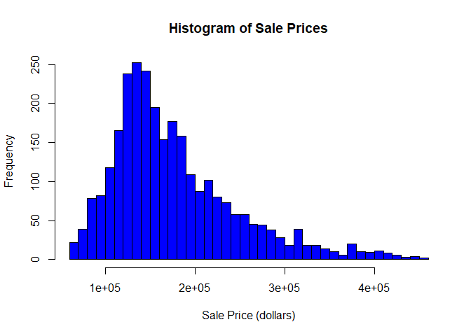
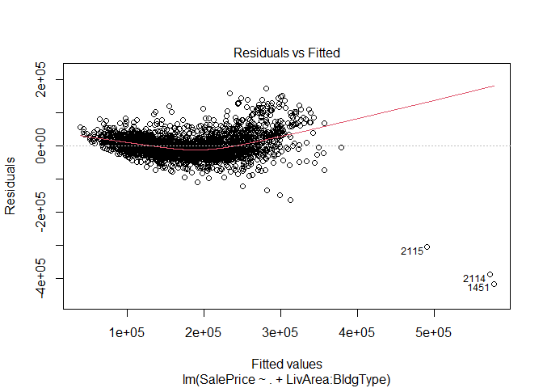
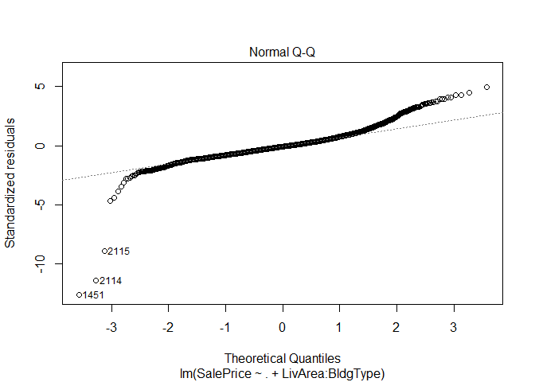
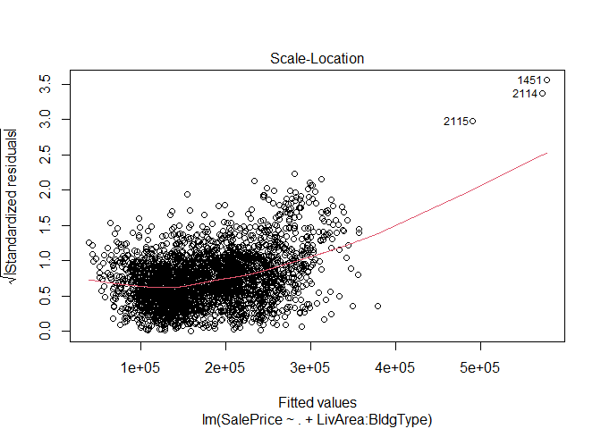
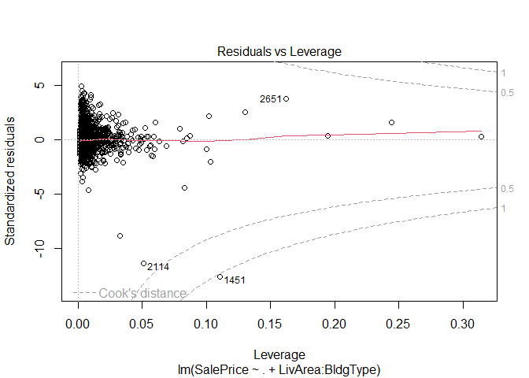
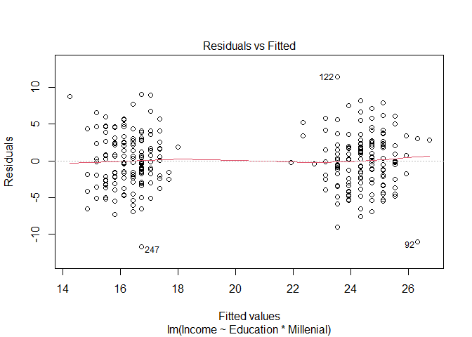
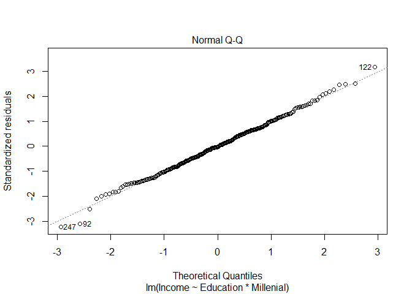
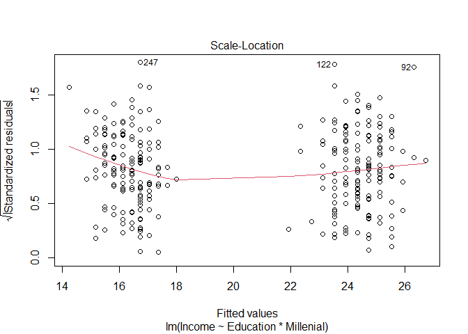
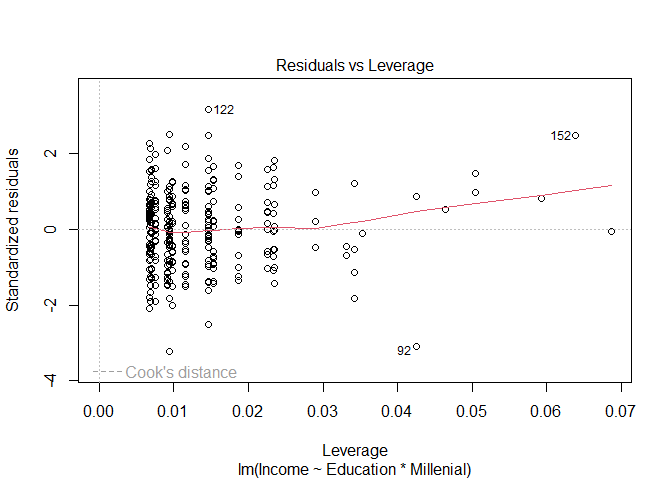

Vy Dang
2024-09-30

# Ames Housing Market Analysis: Predicting Home Values Through Property Characteristics

## Executive Summary
This analysis examines factors driving home prices in Ames, Iowa using multiple regression techniques. By analyzing 2,838 property sales from 2006-2010, I developed predictive models that identify key value drivers and their interactions. The findings demonstrate how living area impacts property value differently across building types, providing insights valuable for real estate professionals, buyers, and sellers.

## Project Overview
The Ames housing market presents an excellent case study for understanding property valuation dynamics. This analysis explores how various property characteristics contribute to sale prices, with particular focus on how the relationship between living area and price varies by building type.

## Data Description
The dataset encompasses 2,838 property sales in Ames, Iowa from 2006-2010, with 12 key variables:

- **SalePrice**: The property's sale price (target variable)
- **TotalRooms**: Total number of rooms
- **Bedrooms**: Number of bedrooms
- **FullBath**: Number of full bathrooms
- **HalfBath**: Number of half bathrooms
- **LivArea**: Ground living area (square feet)
- **Fireplaces**: Number of fireplaces
- **GarageArea**: Size of garage (square feet)
- **PoolArea**: Size of pool (square feet)
- **YearBuilt**: Original construction date
- **YearSold**: Year of sale
- **BldgType**: Type of dwelling (categorical)


``` r
ames = read.csv ("AmesSales.csv")
ames$SalePrice = as.numeric(ames$SalePrice)
```

## Exploratory Analysis
Initial visualization reveals the distribution of sale prices in the market:

``` r
hist(ames$SalePrice, 
     main = "Histogram of Sale Prices",
     xlab = "Sale Price (dollars)",
     ylab = "Frequency",
     col = "blue",
     breaks = 30) 
```



The distribution shows positive skewness, with most homes selling below $200,000 but a long tail extending to higher-value properties.

## Regression Analysis

### Baseline Model
I developed an initial multiple regression model with all available predictors:

``` r
model <- lm(SalePrice ~ ., data = ames)
summary(model)
```

    ## 
    ## Call:
    ## lm(formula = SalePrice ~ ., data = ames)
    ## 
    ## Residuals:
    ##     Min      1Q  Median      3Q     Max 
    ## -420874  -20319   -2800   15500  172652 
    ## 
    ## Coefficients:
    ##                  Estimate Std. Error t value Pr(>|t|)    
    ## (Intercept)    -1.016e+06  1.020e+06  -0.996   0.3192    
    ## TotalRooms      1.806e+03  8.611e+02   2.097   0.0361 *  
    ## Bedrooms       -1.245e+04  1.192e+03 -10.440  < 2e-16 ***
    ## FullBath        2.916e+02  1.859e+03   0.157   0.8754    
    ## HalfBath       -1.258e+04  1.605e+03  -7.841 6.29e-15 ***
    ## Fireplaces      1.328e+04  1.195e+03  11.111  < 2e-16 ***
    ## LivArea         7.892e+01  3.017e+00  26.158  < 2e-16 ***
    ## GarageArea      5.993e+01  4.090e+00  14.654  < 2e-16 ***
    ## PoolArea       -1.038e+02  1.952e+01  -5.315 1.15e-07 ***
    ## YearBuilt       8.709e+02  3.062e+01  28.444  < 2e-16 ***
    ## YearSold       -3.210e+02  5.064e+02  -0.634   0.5263    
    ## BldgType2fmCon -1.142e+04  4.737e+03  -2.411   0.0160 *  
    ## BldgTypeDuplex -3.581e+04  3.702e+03  -9.674  < 2e-16 ***
    ## BldgTypeTwnhs  -2.889e+04  3.780e+03  -7.643 2.90e-14 ***
    ## BldgTypeTwnhsE -1.151e+04  2.731e+03  -4.216 2.56e-05 ***
    ## ---
    ## Signif. codes:  0 '***' 0.001 '**' 0.01 '*' 0.05 '.' 0.1 ' ' 1
    ## 
    ## Residual standard error: 35400 on 2823 degrees of freedom
    ## Multiple R-squared:  0.7468, Adjusted R-squared:  0.7455 
    ## F-statistic: 594.6 on 14 and 2823 DF,  p-value: < 2.2e-16

**Key Results**:
- Model R² = 0.747, indicating the model explains 74.7% of variance in sale prices
- Adjusted R² = 0.746, showing minimal overfitting
- Highly significant predictors include:
  - Living area (p < 0.001)
  - Year built (p < 0.001)
  - Fireplaces (p < 0.001)
  - Garage area (p < 0.001)

### Enhanced Model with Interaction Effects
Recognizing that the relationship between living area and price may vary by building type, I developed an enhanced model incorporating interaction effects:

``` r
model_interaction <- lm(SalePrice ~ . + LivArea:BldgType, data = ames)
summary(model_interaction)
```

    ## 
    ## Call:
    ## lm(formula = SalePrice ~ . + LivArea:BldgType, data = ames)
    ## 
    ## Residuals:
    ##     Min      1Q  Median      3Q     Max 
    ## -417600  -19738   -2639   15254  173605 
    ## 
    ## Coefficients:
    ##                          Estimate Std. Error t value Pr(>|t|)    
    ## (Intercept)            -1.439e+06  1.013e+06  -1.421  0.15553    
    ## TotalRooms              2.007e+03  8.558e+02   2.345  0.01911 *  
    ## Bedrooms               -1.152e+04  1.202e+03  -9.584  < 2e-16 ***
    ## FullBath                4.304e+02  1.844e+03   0.233  0.81540    
    ## HalfBath               -1.191e+04  1.597e+03  -7.460 1.15e-13 ***
    ## Fireplaces              1.292e+04  1.185e+03  10.901  < 2e-16 ***
    ## LivArea                 7.763e+01  3.009e+00  25.799  < 2e-16 ***
    ## GarageArea              6.080e+01  4.058e+00  14.981  < 2e-16 ***
    ## PoolArea               -1.021e+02  1.935e+01  -5.278 1.41e-07 ***
    ## YearBuilt               8.612e+02  3.055e+01  28.188  < 2e-16 ***
    ## YearSold               -1.023e+02  5.030e+02  -0.203  0.83889    
    ## BldgType2fmCon          2.118e+04  1.432e+04   1.479  0.13927    
    ## BldgTypeDuplex         -3.910e+03  1.273e+04  -0.307  0.75868    
    ## BldgTypeTwnhs           1.689e+03  1.432e+04   0.118  0.90607    
    ## BldgTypeTwnhsE         -7.790e+04  1.124e+04  -6.931 5.16e-12 ***
    ## LivArea:BldgType2fmCon -2.177e+01  9.014e+00  -2.415  0.01580 *  
    ## LivArea:BldgTypeDuplex -1.988e+01  7.497e+00  -2.652  0.00804 ** 
    ## LivArea:BldgTypeTwnhs  -2.420e+01  1.103e+01  -2.194  0.02829 *  
    ## LivArea:BldgTypeTwnhsE  5.039e+01  8.102e+00   6.219 5.74e-10 ***
    ## ---
    ## Signif. codes:  0 '***' 0.001 '**' 0.01 '*' 0.05 '.' 0.1 ' ' 1
    ## 
    ## Residual standard error: 35070 on 2819 degrees of freedom
    ## Multiple R-squared:  0.7518, Adjusted R-squared:  0.7502 
    ## F-statistic: 474.4 on 18 and 2819 DF,  p-value: < 2.2e-16
    
**Model Comparison**:
- The enhanced model achieves R² = 0.752 (improvement from 0.747)
- Adjusted R² increases to 0.750
- F-test confirms significant improvement (p < 0.001)
  
### Statistical Testing

Multiple R^2 increases from 0.7468 to 0.7518. Adjusted R^2 increases
from 0.7455 to 0.7502. The increase in these values suggests an
improvement in explanatory power when adding the interaction term.
However, these values alone don’t confirm if the improvement is
statistically significant. Here we conduct an f-test:

``` r
anova(model, model_interaction)
```

    ## Analysis of Variance Table
    ## 
    ## Model 1: SalePrice ~ TotalRooms + Bedrooms + FullBath + HalfBath + Fireplaces + 
    ##     LivArea + GarageArea + PoolArea + YearBuilt + YearSold + 
    ##     BldgType
    ## Model 2: SalePrice ~ TotalRooms + Bedrooms + FullBath + HalfBath + Fireplaces + 
    ##     LivArea + GarageArea + PoolArea + YearBuilt + YearSold + 
    ##     BldgType + LivArea:BldgType
    ##   Res.Df        RSS Df  Sum of Sq     F    Pr(>F)    
    ## 1   2823 3.5381e+12                                  
    ## 2   2819 3.4673e+12  4 7.0799e+10 14.39 1.236e-11 ***
    ## ---
    ## Signif. codes:  0 '***' 0.001 '**' 0.01 '*' 0.05 '.' 0.1 ' ' 1

- The RSS decreases from Model 1 to Model 2, indicating a better fit in
  Model 2.
- Since p-value for the f-statistics is 1.236e-11 (extremely low) \<
  0.05. This indicates that the improvement in the model fit due to the
  inclusion of the interaction terms is highly statistically
  significant. So Model 2 provides a substantial and statistically
  significant improvement in predictive power compared to Model 1.

The F-test results (F = 14.39, p = 1.236e-11) provide strong statistical evidence that the interaction model significantly improves predictive power. This confirms that building type modifies the relationship between living area and sale price.

## Diagnostic Analysis
Model diagnostic plots reveal the appropriateness of our linear model assumptions:

``` r
plot(model_interaction)
```



**Key Findings**: Based on the findings from the diagnostic plots:

- **Linearity:** No pattern seen in the Residuals vs Fitted plot, we can
  assume linearity

- **Normality:** Points fall roughly along a straight line on the normal Q-Q
  plot, suggesting that residuals are normally distributed

- **Homoscedasticity:** The Scale-Location plot shows no discernible pattern
  of the points (randomly scattered), which we can infer
  homoscedasticity and we know the prediction intervals might not be too
  wide or too narrow.

- **Influential Points:** There’s only 1 point outside the dashed line
  Cook’s distance. This suggests the model might still be robust but
  caution is advised. Even though this point is influential, its
  singularity might imply limited overall impact on the model’s
  predictions.

## Key Insights

### 1. Living Area Impact Varies by Building Type
The interaction analysis reveals that each additional square foot of living area affects price differently across building types:
- Single-family homes: $77.63 per sq ft
- Two-family conversions: $55.86 per sq ft (-$21.77 difference)
- Duplexes: $57.75 per sq ft (-$19.88 difference)
- Townhouses: $53.43 per sq ft (-$24.20 difference)
- End-unit townhouses: $128.02 per sq ft (+$50.39 difference)

### 2. Non-Linear Effects
The significant interactions demonstrate that simple linear models fail to capture the full complexity of the housing market. The premium for additional space varies substantially by property type.

### 3. Other Key Drivers
Beyond living area, several factors significantly influence home prices:
- Year built: $860 increase per year newer
- Fireplaces: $13,280 premium per fireplace
- Garage area: $60 per square foot
- Pool area: $102 decrease per square foot (counterintuitive result worth investigating)

## Business Applications

### For Real Estate Professionals
- Use differentiated pricing strategies based on building type
- Better inform clients about the value of square footage in different property types
- Provide more accurate comparative market analyses

### For Home Buyers
- Understand how property type affects the value of additional living space
- Make informed decisions about trade-offs between size and property type
- Better evaluate listing prices against market expectations

### For Home Sellers
- Optimize listing prices based on specific property characteristics
- Understand which improvements provide the best return on investment
- Set realistic expectations for property valuation

## Model Limitations and Considerations

1. **High-Leverage Points**: One property shows disproportionate influence on the model, suggesting potential outliers or unique properties
2. **Temporal Factors**: The model includes year sold but may not fully capture market dynamics over time
3. **Geographic Factors**: The model doesn't include neighborhood or location-specific variables
4. **Market Conditions**: External economic factors aren't directly included

## Conclusions
This analysis demonstrates the importance of considering interaction effects in housing price models. The relationship between living area and price varies significantly by building type, with end-unit townhouses commanding the highest premium per square foot and standard townhouses the lowest. These insights can help all market participants make more informed decisions.

Future enhancements could include:
- Incorporating neighborhood effects
- Adding economic indicators
- Exploring non-linear relationships for other variables
- Developing separate models for different market segments

  
# Education-Income Relationship: Extended Analysis with Diagnostic Validation

## Executive Summary
This analysis extends previous research on the education-income relationship by conducting thorough diagnostic testing and developing robust prediction intervals. Using data from 300 workforce participants in a rural area, I examine how the relationship between education and income varies by generation while assessing model validity and providing practical prediction tools for income estimation.

## Project Overview
Building on prior findings that revealed differential returns to education across generations, this analysis focuses on validating model assumptions and developing practical applications for income prediction. The study addresses critical questions about model reliability and provides tools for accurate income forecasting.

## Data and Context
The dataset comprises 300 workforce participants from a rural area, with key variables:
- **Income**: Annual income in thousands of dollars
- **Education**: Years of formal education completed
- **Millennial**: Generational status indicator (born 1980-1996)

## Model Development and Validation

### Regression Model with Interaction Effects
I developed a comprehensive model incorporating both main effects and interaction terms:

``` r
edu <- read.csv("edu.csv")
edu$Millenial <- factor(edu$Millenial)
edu_model <- lm(Income ~ Education*Millenial, data = edu)
summary(edu_model)
```

    ## 
    ## Call:
    ## lm(formula = Income ~ Education * Millenial, data = edu)
    ## 
    ## Residuals:
    ##      Min       1Q   Median       3Q      Max 
    ## -11.7340  -2.4806  -0.0789   2.3921  11.4760 
    ## 
    ## Coefficients:
    ##                         Estimate Std. Error t value Pr(>|t|)    
    ## (Intercept)             21.12971    1.23767  17.072  < 2e-16 ***
    ## Education                0.39905    0.14565   2.740  0.00652 ** 
    ## MillenialTRUE           -8.15296    1.89865  -4.294 2.38e-05 ***
    ## Education:MillenialTRUE -0.08595    0.19761  -0.435  0.66393    
    ## ---
    ## Signif. codes:  0 '***' 0.001 '**' 0.01 '*' 0.05 '.' 0.1 ' ' 1
    ## 
    ## Residual standard error: 3.655 on 296 degrees of freedom
    ## Multiple R-squared:  0.5654, Adjusted R-squared:  0.561 
    ## F-statistic: 128.3 on 3 and 296 DF,  p-value: < 2.2e-16

**Model Results**:
- R² = 0.565, explaining 56.5% of income variation
- Significant generational baseline differences (p < 0.001)
- Positive education effects within each generation
- Non-significant interaction term (p = 0.664)

### Diagnostic Analysis
To assess model validity, I conducted comprehensive diagnostic testing:

``` r
plot(edu_model)
```



#### Key Diagnostic Findings:

- **Linearity:** The Residuals vs Fitted plot points to potential
  non-linearity or differing relationships within subsets of data,
  particularly between Millenials and non-Millenials.

- **Normality:** Points fall roughly along a straight line on the normal Q-Q
  plot, suggesting that residuals are normally distributed

- **Homoscedasticity:** The Scale-Location plot indicates issues with
  constant variance (heteroscedasticity), showing two clusters of data
  points

- **Influential Points:** The Residuals vs Leverage plot does not indicate
  significant issues with influential points.

### Model Limitations and Considerations

Based on this, the assumptions of the stronger linear model may not hold
true in this case.

Based on diagnostic analysis:
- The assumptions of the classical linear model are partially violated
- Heteroscedasticity may affect the precision of standard errors
- Despite limitations, the model provides valuable insights into generational differences

## Practical Applications: Income Prediction

### Confidence Intervals for Expected Income
I developed a 95% confidence interval for expected income of Millennials with 8 years of education assuming the stronger linear model holds:

``` r
new_data <- data.frame(
  Education = 8,
  Millenial = TRUE
)
new_data$Millenial <- factor(new_data$Millenial, levels = levels(edu$Millenial))
conf_int <- predict(edu_model, newdata = new_data, interval = "confidence", level = 0.95)
conf_int
```

    ##        fit      lwr     upr
    ## 1 15.48157 14.59104 16.3721

**Result**: The expected income for Millennials with 8 years of education is $15,482, with a 95% confidence interval of [$14,591, $16,372].

### Comparative Income Analysis
To understand income differences across groups, I calculated confidence intervals for the difference between:
- A Millennial with 8 years of education
- A non-Millennial with 7 years of education

``` r
c <- data.frame(Education = 8, Millenial = 'TRUE')
d <- data.frame(Education = 7, Millenial = 'FALSE')
pred_c <- predict(edu_model, newdata = c)
pred_d <- predict(edu_model, newdata = d)
pred_c
```

    ##        1 
    ## 15.48157

``` r
pred_d
```

    ##        1 
    ## 23.92305

``` r
diff_pred <- pred_c - pred_d
V_beta <- vcov(edu_model)
diff_vec <- c(1, 8, 1, 8) - c(1, 7, 0, 0)
se_diff <- sqrt(t(diff_vec) %*% V_beta %*% diff_vec)
df <- nrow(edu) - length(coef(edu_model))
t_critical <- qt(0.975, df)
margin_of_error <- t_critical * se_diff
lower_bound <- diff_pred - margin_of_error
upper_bound <- diff_pred + margin_of_error
conf_interval <- c(lower_bound, upper_bound)
conf_interval
```

    ## [1] -9.566549 -7.316420
    
**Result**: The expected income difference is -$8,442, with a 95% confidence interval of [-$9,567, -$7,316]. This indicates Millennials with 8 years of education earn significantly less than non-Millennials with 7 years of education.

### Individual Variation Analysis
To understand income variation between individuals with identical characteristics:

``` r
model_summary <- summary(edu_model)
sigma_hat <- model_summary$sigma
df <- nrow(edu) - length(coef(edu_model))
t_critical <- qt(0.975, df)
se_diff = sqrt(2) * sigma_hat
margin_of_error <- t_critical * se_diff
lower_bound <- 0 - margin_of_error
upper_bound <- 0 + margin_of_error
conf_interval <- c(lower_bound, upper_bound)
conf_interval
```

    ## [1] -10.17384  10.17384

**Result**: The 95% confidence interval for the difference in income between two individuals with identical education and generational status is [-$10,174, $10,174], reflecting substantial individual variation beyond these measured factors.

## Key Insights and Implications

### 1. Model Validity Considerations
While the model provides valuable insights, users should be aware of:
- Heteroscedasticity in residuals
- Potential non-linearity in subgroups
- The need for cautious interpretation of standard errors

### 2. Practical Prediction Guidelines
When using this model for prediction:
- Confidence intervals are most reliable near the center of the data distribution
- Predictions for extreme education levels should be treated with caution
- Consider using robust standard errors for more conservative intervals

### 3. Policy and Planning Implications
The analysis confirms:
- Significant generational income gaps persist even after controlling for education
- Individual variation is substantial, suggesting other unmeasured factors play important roles
- Educational planning should consider generational context

## Recommendations for Future Analysis

1. **Address Heteroscedasticity**
   - Implement weighted least squares
   - Use heteroscedasticity-consistent standard errors
   - Consider transformation of the dependent variable

2. **Explore Non-Linear Relationships**
   - Test polynomial terms for education
   - Consider spline regression for more flexible modeling
   - Investigate threshold effects

3. **Expand Variable Set**
   - Include field of study or occupation
   - Add geographic factors
   - Consider family background variables

## Conclusion
This extended analysis confirms the robustness of the generational differences in education-income relationships while identifying important model limitations. The diagnostic assessment reveals heteroscedasticity and potential non-linearity issues that warrant consideration in practical applications. Despite these limitations, the model provides valuable tools for income prediction and policy planning, particularly when used with appropriate caution regarding its assumptions and limitations.
